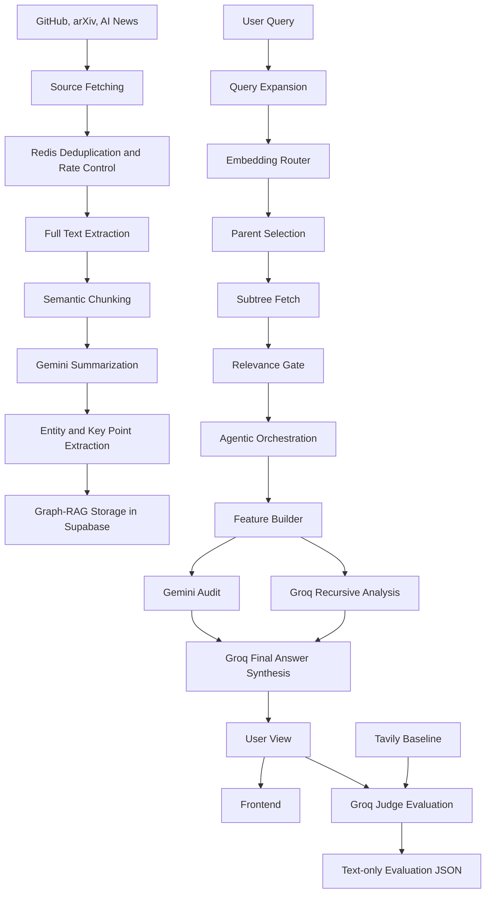

# FusionAI AI News Research Pipeline: An End-to-End Graph-RAG, Agentic Synthesis, and Automatic Evaluation Framework

## Abstract

FusionAI's AI News research pipeline is a full-stack research intelligence system that collects fast-moving artificial intelligence information, converts it into a persistent Graph-RAG substrate, retrieves evidence through entity-aware hybrid ranking, synthesizes direct answers with an LLM, and evaluates each query against a Tavily search baseline. The system is designed for higher information gain than ordinary search: instead of only returning links or short snippets, it builds a structured understanding of AI news, GitHub repositories, and arXiv papers, then produces evidence-grounded answers, related topic suggestions, follow-up angles, and backend-only quality evaluations. This document describes the pipeline end to end, including ingestion, semantic chunking, graph construction, query processing, relevance filtering, agentic orchestration, Groq final-answer synthesis, evaluation metrics, observed results, limitations, and future research directions.

## 1. Introduction

AI research and product development move across several channels at once: papers, repositories, technical blogs, product launches, and news coverage. A normal search interface can surface recent documents, but it often does not explain relationships between sources, preserve prior context, or evaluate whether the final answer is better than a search result.

FusionAI's AI News component approaches this as a research intelligence problem. It maintains a continuously updated graph of AI-related information and uses that graph during query time to answer user questions with retrieved evidence. The pipeline is implemented primarily under:

```text
backend/routes/Research_Routes/
```

The user-facing query endpoint is:

```text
/ai-news/query
```

The backend automatically evaluates each query response and saves the benchmark data to:

```text
data/benchmarks/query_evaluations.json
data/benchmarks/latest_query_evaluation.json
```

## 2. Research Objectives

The pipeline is designed around five objectives:

1. Convert raw AI updates into a reusable graph memory instead of treating each query as a stateless search.
2. Retrieve evidence using semantic, lexical, entity, freshness, and graph signals.
3. Generate direct user-facing answers from retrieved evidence rather than exposing internal pipeline diagnostics.
4. Recommend related topics that expand the user's research direction.
5. Evaluate every query against Tavily using an independent Groq LLM judge and store cumulative results.

## 3. System Overview

The system has two planes: an ingestion plane and a query plane.



## 4. Ingestion Pipeline

### 4.1 Source Collection

The ingestion layer collects information from three source families:

- GitHub repositories
- arXiv AI papers
- AI news sources

Each item is normalized into a shared structure with fields such as title, URL, source type, creation time, fetch time, and metadata. This makes later processing source-agnostic.

### 4.2 Deduplication and Rate Awareness

Redis is used to reduce duplicate ingestion and control source activity:

- `ai:seen_ids` prevents duplicate items from being processed repeatedly.
- `ai:raw:current` stores the current sliding window of raw AI intelligence.
- `ai:rate:<source>` tracks request pressure per source.
- `ai:activity:<source>` tracks source freshness and activity.

This design improves scalability because the pipeline does not repeatedly summarize or embed the same content.

### 4.3 Query Priority Control

Foreground query execution is prioritized over background ingestion. A Redis query-active counter is used:

```text
ai:query:active_count
```

When a query is running, background source fetching and processing can pause at checkpoints. This helps the user-facing query pipeline receive more compute and LLM bandwidth.

## 5. Document Processing

### 5.1 Semantic Chunking

Raw extracted text is split through a semantic chunking layer instead of simple fixed-size slicing. The goal is to preserve sentence boundaries and local context, producing chunks that are cleaner for summarization and embedding.

Typical chunking parameters are:

```text
chunk_size = 1200
overlap = 180
```

This improves retrieval quality because each embedding represents a coherent topic segment rather than arbitrary text fragments.

### 5.2 Structured Summarization

Each chunk is summarized by Gemini into a structured representation:

```json
{
  "summary": "...",
  "key_points": ["..."],
  "entities": ["..."]
}
```

The processor validates these fields before inserting data into the graph. This validation prevents weak or malformed chunks from corrupting the retrieval layer.

### 5.3 Dataset Generation

Processed chunk-summary examples are saved into the dataset builder flow. This creates a reusable supervised dataset for later evaluation or fine-tuning experiments. The dataset is useful because it captures source text paired with generated summaries, key points, and extracted entities.

## 6. Graph-RAG Storage Layer

The graph layer is implemented under:

```text
backend/routes/Research_Routes/Nexus_Graph_DB/
```

The graph stores structured research memory in Supabase, mainly through graph nodes and an entity index.

### 6.1 Graph Nodes

Each graph node can represent either a leaf chunk or a merged parent topic:

```json
{
  "node_id": "...",
  "type": "leaf | parent",
  "node_embedding": [],
  "summary": "...",
  "actual_content": "...",
  "key_points": [],
  "associated_entities": [],
  "parent_id": null,
  "child_ids": []
}
```

Leaf nodes are created from document chunks. Parent nodes are created when related content is merged into a higher-level topic summary.

### 6.2 Entity Index

The entity index maps extracted entities to active root nodes:

```text
entity -> active graph root
```

At query time, this allows the system to route queries into relevant graph regions instead of blindly scanning all nodes.

### 6.3 Dynamic Graph Merging

When a new node is inserted, the graph engine compares it against active roots. If the new node is similar enough to an existing root, the system creates a merged parent summary using an LLM. This gives the graph a hierarchical structure:

```text
parent topic
  -> previous active root
  -> new leaf node
```

The merge threshold is dynamic, so larger clusters can absorb related content while small clusters remain more selective.

## 7. Query Pipeline

The live query pipeline is implemented in:

```text
backend/routes/Research_Routes/Query_Pipeline/query_controller.py
```

The current end-to-end query path is:

```text
User query
-> Query expansion
-> Embedding routing
-> Parent selection
-> Subtree fetching
-> Relevance gate
-> Agentic orchestration
-> Feature building
-> Gemini audit
-> Groq recursive analysis
-> Groq final answer synthesis
-> User view construction
-> Automatic benchmark evaluation
```

### 7.1 Query Expansion

Groq expands the original user query into multiple related search queries and extracts entities. For example, a query like:

```text
agentic ai updates
```

can expand into related query forms about recent advancements, autonomous agents, safety, workflows, and current trends. This improves recall because one short user query may not match the graph vocabulary exactly.

### 7.2 Embedding Routing

Each expanded query is embedded and routed toward candidate graph roots. The router uses extracted entities when available. If entity routing finds no candidates, the pipeline falls back to global active roots.

### 7.3 Parent Selection

The parent selector scores candidate roots and selects the best root for each routed query. It uses a hybrid score rather than semantic similarity alone.

The hybrid scoring function includes:

- semantic similarity
- lexical overlap
- keyword density
- entity overlap
- freshness

This matters because AI news relevance depends on both meaning and recency.

### 7.4 Subtree Fetching

After selecting parent nodes, the subtree fetcher retrieves each selected parent and its descendants. The result becomes the evidence set for downstream orchestration and answer synthesis.

### 7.5 Relevance Gate

A relevance gate was added before orchestration. It rejects low-signal subtrees when they do not meet minimum hybrid, lexical, keyword, or entity relevance thresholds.

This was added because benchmark inspection showed that some retrieved evidence could be off-topic. For example, a query about agentic AI could previously retrieve unrelated source summaries. Filtering such evidence before orchestration reduces hallucination risk and improves final-answer correctness.

The gate logs:

```text
[PIPELINE] Relevance gate kept X subtrees and rejected Y low-signal subtrees
```

If all subtrees fail the gate, the pipeline keeps the best available subtree rather than returning no evidence. This preserves robustness for sparse graph states.

## 8. Agentic Orchestration

The orchestrator runs multiple analysis services:

1. Strategy service
2. Risk service
3. Ethics service
4. Audit service

These services transform retrieved subtrees into structured features for downstream reasoning.

### 8.1 Strategy Service

The strategy service identifies:

- dominant selected topic
- related topics
- temporal trend signals

This is used for topic routing, related search suggestions, and final answer context.

### 8.2 Risk Service

The risk service compares retrieved parent nodes and detects abnormal redundancy or suspicious similarity. This helps identify whether the retrieval output is too repetitive or overly narrow.

### 8.3 Ethics Service

The ethics service checks semantic alignment inside retrieved subtrees. Low alignment can indicate a poorly clustered graph region or a source set that should not be trusted without qualification.

### 8.4 Audit Service

The audit service validates summary-key point alignment. If key points are weakly supported by their summary, the answer synthesis layer can be more cautious.

## 9. Feature Builder

The feature builder converts orchestration outputs into structured feature groups:

- graph features
- risk features
- ethics features
- audit features
- strategy features

These features are used by the Gemini audit service and are also passed as compact diagnostic context to final synthesis.

## 10. Answer Synthesis

The pipeline uses three LLM-backed reasoning layers, each with a different role.

### 10.1 Gemini Audit

Gemini audit is diagnostic. It evaluates risk, ethics, and audit features and produces system-level observations such as:

- overall assessment
- detected issues
- retrieval improvements
- clustering improvements
- summarization improvements
- final diagnostic conclusion

This output is useful for debugging, but it is not supposed to be the final answer to the user.

### 10.2 Groq Recursive Analysis

Groq recursive analysis generates follow-up questions, answers them from retrieved context, and critiques the generated reasoning. This provides deeper research angles and helps the frontend show follow-up directions.

### 10.3 Groq Final Answer Synthesis

A dedicated final-answer service now produces the main user-facing answer:

```text
backend/routes/Research_Routes/Query_Pipeline/groq_final_answer_service.py
```

This service receives:

- original user query
- selected topic
- expanded queries
- related topics
- retrieved evidence contexts
- compact audit summary

The prompt instructs Groq to:

- answer the original question directly
- use only retrieved evidence
- include evidence markers such as `[Evidence 1]`
- mention limitations when evidence is incomplete
- suggest related searches

This change fixed the earlier failure mode where the user-facing answer could become an internal audit report instead of an answer to the query.

## 11. User-Facing Response Model

The frontend consumes only:

```text
response.user_view
```

The user view contains:

```json
{
  "query": "...",
  "topic_name": "...",
  "summary": "...",
  "similar_topics": [],
  "recommended_searches": [],
  "key_findings": [],
  "evidence_used": [],
  "limitations": [],
  "follow_up_questions": [],
  "answers": [],
  "retrieved_evidence": [],
  "expanded_queries": []
}
```

The frontend intentionally does not show benchmark evaluation analysis. It shows only relevant research output such as the final answer, related topics, follow-up angles, and retrieved evidence snippets.

## 12. Automatic Evaluation Framework

Every `/ai-news/query` call triggers backend-only evaluation after FusionAI produces its answer.

The evaluator compares:

```text
Question
Tavily Answer
FusionAI Answer
Tavily Supporting Text
FusionAI Evidence Text
```

The judge is:

```text
groq/llama-3.3-70b-versatile
```

The judge scores both systems independently first, then chooses an overall winner. This reduces direct winner-selection bias because the judge must assign metric-level scores before deciding.

### 12.1 Evaluation Metrics

The evaluation uses eight metrics:

| Metric | Direction | Meaning |
| --- | --- | --- |
| Correctness | Higher is better | Factual alignment with the question and evidence |
| Completeness | Higher is better | Coverage of the important parts of the query |
| Context coverage | Higher is better | Breadth of relevant supporting context |
| Reasoning depth | Higher is better | Quality of synthesis beyond shallow retrieval |
| Actionability | Higher is better | Practical usefulness of the answer |
| Information gain | Higher is better | How much the answer teaches beyond a basic search result |
| Citation coverage | Higher is better | How clearly and broadly evidence is integrated |
| Hallucination risk | Lower is better | Risk that the answer contains unsupported claims |

### 12.2 Text-Only Evaluation Storage

The benchmark JSON intentionally excludes full embeddings, vectors, and raw graph internals. It stores only text and scores:

- question
- Tavily answer text
- Tavily support snippets
- FusionAI answer text
- FusionAI evidence snippets
- topic text
- similar topic text
- judge scores
- metric winners
- cumulative dominance

This keeps the benchmark readable and avoids dumping high-dimensional embedding data.

## 13. Latest Evaluation Results

The current `query_evaluations.json` contains two evaluations. The latest evaluation was for:

```text
agentic ai updates
```

The latest winner was:

```text
FusionAI
```

The judge rationale states that FusionAI had higher correctness, completeness, actionability, and lower hallucination risk, while Tavily still had broader context coverage and citation coverage.

### 13.1 Latest Score Table

| Metric | FusionAI | Tavily | Winner |
| --- | ---: | ---: | --- |
| Correctness | 9 | 8 | FusionAI |
| Completeness | 8 | 7 | FusionAI |
| Context coverage | 7 | 8 | Tavily |
| Reasoning depth | 7 | 6 | FusionAI |
| Actionability | 8 | 5 | FusionAI |
| Information gain | 8 | 6 | FusionAI |
| Citation coverage | 8 | 9 | Tavily |
| Hallucination risk | 3 | 4 | FusionAI |

For hallucination risk, lower is better.

### 13.2 Improvement Over Previous Evaluation

The earlier evaluation showed FusionAI returning an internal audit-style answer, which caused low scores. After adding relevance filtering and direct final-answer synthesis, FusionAI improved substantially:

| Metric | FusionAI Before | FusionAI Latest | Change |
| --- | ---: | ---: | ---: |
| Correctness | 2 | 9 | +7 |
| Completeness | 2 | 8 | +6 |
| Context coverage | 2 | 7 | +5 |
| Reasoning depth | 4 | 7 | +3 |
| Actionability | 3 | 8 | +5 |
| Information gain | 2 | 8 | +6 |
| Citation coverage | 2 | 8 | +6 |
| Hallucination risk | 8 | 3 | -5 |

The largest gains came from:

- replacing diagnostic output with direct final-answer synthesis
- grounding the final answer in retrieved evidence
- adding `[Evidence N]` markers
- filtering low-relevance retrieved subtrees before orchestration
- keeping evaluation text-only and focused on the actual user-facing answer

### 13.3 Cumulative Dominance

Across the two stored evaluations:

| Metric | Current Leader |
| --- | --- |
| Correctness | Tie |
| Completeness | Tie |
| Context coverage | Tavily |
| Reasoning depth | Tie |
| Actionability | Tie |
| Information gain | Tie |
| Citation coverage | Tavily |
| Hallucination risk | Tie |
| Overall winner | Tie |

This shows that FusionAI has improved enough to win the latest run, but more benchmark queries are needed before claiming stable dominance over Tavily.

## 14. Why the Pipeline Improved

The earlier system already had advanced retrieval and orchestration, but its final answer selection was weak. The benchmark exposed two main issues:

1. The answer being judged could be a pipeline audit summary rather than a direct answer.
2. Retrieved context could include off-topic nodes, which increased hallucination risk.

The improved pipeline addresses both:

- The final Groq answer service answers the original query directly.
- The service receives retrieved evidence and is instructed to use only that evidence.
- The relevance gate removes noisy subtrees before synthesis.
- The frontend and evaluator both consume `user_view.summary`, which now prioritizes the final answer.
- The benchmark stores the final answer and evidence text, not internal embeddings or full raw graph objects.

## 15. Reliability and Scalability Features

The pipeline includes several engineering safeguards:

- lazy initialization for heavy AI services
- Redis-backed deduplication
- rate-aware ingestion
- query-active pause control for background workers
- semantic chunking for cleaner embeddings
- hybrid ranking for retrieval quality
- relevance gating for noisy evidence reduction
- timeout protection around LLM calls
- fallback behavior for recursive analysis and final synthesis
- text-only evaluation persistence

These features make the system more reliable under live query workloads and easier to debug.

## 16. Limitations

The current system still has limitations:

1. Tavily can still outperform FusionAI on broad live context coverage because it searches the web directly at query time.
2. Citation coverage is based on evidence markers and snippets, not formal source-level citation rendering in the frontend.
3. The evaluation judge is an LLM, so scores may vary across runs.
4. The current benchmark set is still small; two evaluations are not enough for strong statistical claims.
5. Graph quality depends on upstream extraction, summarization, and entity extraction quality.
6. Some retrieved contexts may still be partially relevant but not comprehensive enough for fast-moving breaking news.

## 17. Future Work

Recommended next improvements:

1. Add a larger fixed benchmark suite with diverse AI-news, paper, GitHub, and safety queries.
2. Add source-level citations in the frontend using provenance URLs from retrieved graph nodes.
3. Add temporal reranking so very recent AI updates are prioritized for news-like queries.
4. Add multi-judge evaluation across Groq, Gemini, and a local model to reduce evaluator bias.
5. Add ablation testing for semantic-only retrieval, hybrid retrieval, graph retrieval, and relevance-gated retrieval.
6. Add graph visualization for selected subtrees so users can inspect why FusionAI chose an answer.
7. Add a live freshness score to the final answer when Tavily or source ingestion suggests newer information exists.

## 18. Conclusion

FusionAI's AI News research pipeline is an advanced Graph-RAG and agentic synthesis system for AI intelligence. It ingests live AI sources, creates a structured graph memory, retrieves relevant subtrees through hybrid ranking, filters noisy evidence, runs agentic analysis services, and generates a direct Groq-synthesized answer grounded in retrieved evidence. The automatic evaluation framework compares FusionAI with Tavily on correctness, completeness, context coverage, reasoning depth, actionability, information gain, citation coverage, and hallucination risk.

The latest benchmark shows a meaningful improvement: FusionAI won the most recent evaluation for `agentic ai updates`, with correctness rising from 2 to 9 and hallucination risk dropping from 8 to 3. The system is not simply a search wrapper; it is a reusable research intelligence pipeline designed to preserve knowledge, synthesize evidence, and continuously measure whether its answers are becoming more useful than baseline search.
