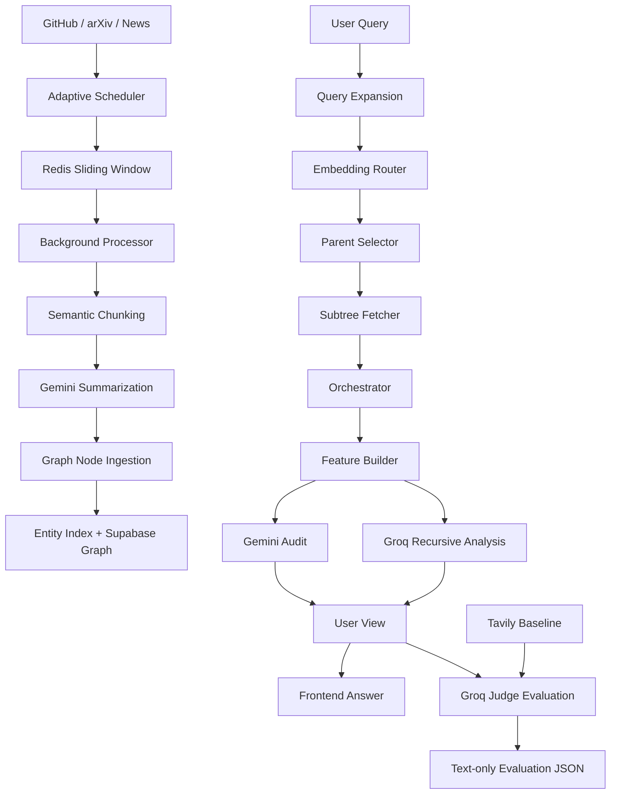

# FusionAI AI News Research Pipeline: A Graph-RAG and Agentic Evaluation Framework for Live AI Intelligence

## Abstract

FusionAI's AI News research pipeline is a full-stack intelligence system designed to collect, structure, retrieve, synthesize, and evaluate fast-moving artificial intelligence information from live web sources. Unlike a conventional search interface that returns ranked links, the pipeline converts AI news, GitHub repositories, and arXiv papers into a persistent graph-based retrieval substrate, then performs query expansion, hybrid retrieval, subtree selection, multi-service orchestration, recursive synthesis, and automatic answer evaluation. The system combines live ingestion, semantic chunking, LLM-based summarization, entity-aware graph construction, hybrid ranking, risk and audit services, and Groq-based evaluation against a Tavily search baseline. This document presents the design as a research-paper-style technical specification, covering system architecture, ingestion, graph construction, query processing, evaluation methodology, observed engineering trade-offs, and future extensions.

## 1. Introduction

Modern AI research changes quickly across papers, repositories, product releases, and news coverage. A basic search engine can retrieve fresh documents, but it often leaves users with fragmented results and little explanation of how multiple sources relate. FusionAI's AI News component addresses this gap by treating incoming AI information as an evolving research graph rather than a flat list of search results.

The main goal of the system is to maximize information gain for the user. Instead of only answering "what was found?", the pipeline attempts to answer:

- What is the dominant topic behind the query?
- Which related topics should the user investigate next?
- What retrieved evidence supports the answer?
- How reliable, complete, and actionable is the synthesized response?
- Does FusionAI produce more useful research output than a basic Tavily search baseline?

The pipeline is implemented primarily under:

```text
backend/routes/Research_Routes/
```

The API is exposed through:

```text
/ai-news/get
/ai-news/query
```

The frontend AI News interface consumes only user-facing analysis from `response.user_view`, while backend evaluation artifacts are written separately to JSON.

## 2. System Contributions

The AI News research pipeline contributes five major capabilities:

1. Live AI intelligence ingestion from GitHub, arXiv, and news sources with rate-aware scheduling and Redis-backed freshness control.
2. Semantic document processing that converts raw source content into sentence-aware chunks, summaries, key points, and entities.
3. A graph-based RAG substrate that merges related information into entity-indexed parent/leaf node structures.
4. A query-time agentic orchestration pipeline for expansion, routing, subtree retrieval, risk analysis, ethics checks, audit checks, and recursive synthesis.
5. Automatic per-query evaluation against Tavily using Groq as an LLM judge, saved as text-only JSON evaluation artifacts.

## 3. High-Level Architecture

The AI News pipeline has two major planes: an ingestion plane and a query plane.



## 4. Data Ingestion Methodology

### 4.1 Source Collection

The ingestion layer is implemented in `get_Latest_Data.py`. It collects three source families:

- GitHub repositories through the GitHub search API.
- arXiv AI papers through the arXiv Atom feed.
- AI news through NewsAPI.

Each source item is normalized into a shared record containing:

```json
{
  "title": "...",
  "url": "...",
  "source": "github | papers | news",
  "created_at": "...",
  "fetched_at": "...",
  "meta": {}
}
```

The system filters obviously unsafe source titles using blocked terms such as malware, stealer, phishing, exploit, and related terms.

### 4.2 Adaptive Scheduling

The scheduler tracks source activity in Redis and dynamically adjusts fetch intervals. It also uses rate windows to avoid excessive API usage.

Core mechanisms:

- `ai:activity:<source>` records recent source activity.
- `ai:rate:<source>` tracks request rate.
- `ai:raw:current` stores the current seven-day sliding source window.
- `ai:seen_ids` prevents duplicate ingestion.

The scheduler pauses when a query is active through the Redis-backed query-active flag:

```text
ai:query:active_count
```

This prevents background ingestion and source fetching from competing with live query execution.

### 4.3 Full Document Extraction

After a source enters the sliding window, the extraction layer attempts to obtain full text from the source. The processor only continues if meaningful content is extracted. This reduces low-value graph nodes and avoids inserting empty or shallow source records.

## 5. Document Processing and Dataset Construction

The processing layer is implemented in `processor.py`.

### 5.1 Semantic Chunking

The chunker calls `semantic_chunk_text()` through `chunker.py`, using defaults:

```python
chunk_size = 1200
overlap = 180
```

Instead of arbitrary fixed-length splitting, the semantic chunker attempts to preserve sentence and context boundaries. This improves embedding quality and reduces fragmented summaries.

### 5.2 LLM Summarization

Each chunk is summarized with Gemini through `summarize_with_gemini()`. The summarizer returns structured fields:

```json
{
  "summary": "...",
  "key_points": ["..."],
  "entities": ["..."]
}
```

The processor validates that all required fields exist before inserting the chunk into the graph. It also uses a semaphore to limit concurrent summarization:

```python
semaphore = asyncio.Semaphore(3)
```

This protects the pipeline from flooding the LLM provider.

### 5.3 Dataset Logging

Processed chunk-summary pairs are saved through `dataset_builder.save_sample()`. This creates a growing supervised dataset that can later be used for evaluation, fine-tuning, or synthetic training workflows.

### 5.4 Novelty Scoring

Each chunk receives a novelty score against previous chunks from the same document. This helps preserve diverse information and reduce redundant graph insertion.

## 6. Graph-RAG Storage Model

The graph backend is implemented under:

```text
backend/routes/Research_Routes/Nexus_Graph_DB/
```

The graph is persisted in Supabase using two major tables:

- `graph_nodes`
- `entity_index`

### 6.1 Node Types

The system represents content as graph nodes:

- Leaf nodes: directly produced from document chunks.
- Parent nodes: produced by merging semantically similar roots.

A graph node contains:

```json
{
  "node_id": "...",
  "type": "leaf | parent",
  "node_embedding": [],
  "summary": "...",
  "actual_content": "...",
  "key_points": [],
  "associated_entities": [],
  "parent_id": null,
  "child_ids": []
}
```

### 6.2 Entity Index

The entity index maps entities to active root nodes. This allows query-time routing to begin from relevant graph regions instead of scanning the entire graph.

```text
entity -> active root node
```

### 6.3 Dynamic Merge Threshold

When a new leaf node is inserted, the graph engine compares it to active roots for each entity. The merge threshold is dynamically adjusted according to cluster size:

```text
tau = 1 - sqrt((2 log(cluster_size)) / embedding_dim) * (1 - alpha)
```

Where `alpha` increases with cluster size but remains bounded. This prevents overly aggressive merging in small clusters while allowing larger clusters to consolidate related information.

### 6.4 LLM-Based Parent Node Creation

If a new node is sufficiently similar to an active root, the system calls Groq to merge the two nodes into a new parent summary and parent key points. The new parent is promoted as the active root for that entity.

This gives the graph a hierarchical structure:

```text
parent summary
  ├── child root
  └── new leaf
```

## 7. Query Processing Pipeline

The query pipeline is implemented in:

```text
backend/routes/Research_Routes/Query_Pipeline/query_controller.py
```

The runtime stages are:

1. Query expansion
2. Embedding routing
3. Parent selection
4. Subtree fetching
5. Orchestration
6. Feature building
7. Gemini audit
8. Groq recursive analysis
9. User-view construction
10. Automatic evaluation

### 7.1 Query Expansion

The query expansion service uses Groq to produce related analytical queries and entities. It returns:

```json
{
  "queries": ["original", "expanded 1", "..."],
  "entities": {
    "query text": ["entity1", "entity2"]
  }
}
```

The service includes timeout and fallback behavior. If Groq does not respond, the pipeline continues with the original query.

### 7.2 Embedding Router

The embedding router routes expanded queries through the graph index. It uses query embeddings, entities, and hybrid relevance scoring to identify candidate graph roots.

### 7.3 Parent Selection

The parent selector chooses the best parent/root node per routed query. This stage narrows the search space to the most relevant graph regions.

### 7.4 Subtree Fetching

For each selected parent, the subtree fetcher retrieves the full descendant structure. This supplies both high-level summaries and supporting child content.

## 8. Hybrid Retrieval Scoring

The graph query engine combines semantic and non-semantic signals. The hybrid scoring utility considers:

- semantic similarity
- lexical overlap
- entity overlap
- keyword relevance
- freshness
- source authority

This is important because AI news queries often depend on recency and source credibility, not just vector similarity.

## 9. Agentic Orchestration Layer

The orchestrator is implemented in:

```text
Query_Pipeline/orchestrator.py
```

It runs four services concurrently:

1. Strategy service
2. Risk service
3. Ethics service
4. Audit service

Each service has timeout protection and fallback behavior.

### 9.1 Strategy Service

The strategy service identifies:

- dominant selected topic
- recommended related topics
- temporal trend

It builds topic cubes, analyzes co-occurrence, and ranks entities by frequency and depth.

### 9.2 Risk Service

The risk service compares parent node summaries to identify unusually similar retrieved nodes. This helps detect redundancy or abnormal overlap.

The current live-query path uses a fast lexical scorer by default. A heavier cross-encoder path can be enabled for deeper offline analysis.

### 9.3 Ethics Service

The ethics service checks semantic alignment within retrieved subtrees. Low alignment can indicate inconsistent clustering or weak graph organization.

### 9.4 Audit Service

The audit service compares node summaries against their key points. This detects whether a summary is grounded in its extracted evidence.

## 10. Feature Builder

The feature builder converts orchestration output into structured downstream features:

- graph features
- risk features
- ethics features
- audit features
- strategy features

These features feed both audit generation and final synthesis.

## 11. Answer Synthesis

The final answer is generated through two major services.

### 11.1 Gemini Audit

The Gemini audit service receives risk, ethics, and audit features and produces:

- overall assessment
- detected issues
- system improvements
- retrieval improvements
- clustering improvements
- summarization improvements
- final conclusion

This component focuses on diagnostic quality rather than direct user answer generation.

### 11.2 Groq Recursive Analysis

The Groq recursive analysis service performs:

1. follow-up question generation
2. recursive answer generation
3. critic-mode self-evaluation

If no follow-up questions are generated, the service stops gracefully and returns a structured fallback instead of producing misleading empty analysis.

## 12. User-Facing Response Model

The frontend should not display raw pipeline internals. The backend therefore builds a `user_view` object containing only relevant analysis:

```json
{
  "query": "...",
  "topic_name": "...",
  "summary": "...",
  "similar_topics": [],
  "suggested_searches": [],
  "follow_up_questions": [],
  "answers": [],
  "audit_summary": {},
  "retrieved_evidence": [],
  "expanded_queries": []
}
```

The frontend displays:

- research insight
- dominant topic
- related topics the user can also search for
- generated answers, when available
- follow-up angles, when available
- retrieved evidence snippets

The frontend intentionally does not display benchmark/evaluation metrics.

## 13. Automatic Query Evaluation

Every `/ai-news/query` call automatically triggers backend-only evaluation after the FusionAI answer is produced.

The evaluator compares:

```text
Question
Tavily baseline text
FusionAI answer text
FusionAI evidence text
```

The judge is Groq:

```text
groq/llama-3.3-70b-versatile
```

### 13.1 Evaluation Metrics

Both Tavily and FusionAI are scored independently on:

1. Correctness
2. Completeness
3. Context coverage
4. Reasoning depth
5. Actionability
6. Hallucination risk
7. Information gain
8. Citation coverage

For all metrics except hallucination risk, higher is better. For hallucination risk, lower is better.

### 13.2 Text-Only Evaluation JSON

The evaluation JSON intentionally excludes embeddings, vectors, raw graph internals, and provenance blobs. It stores only:

- question text
- Tavily answer text
- Tavily supporting text snippets
- FusionAI answer text
- FusionAI evidence text snippets
- topic text
- similar topic text
- judge scores
- metric winners
- dominance summary

The files are written to:

```text
data/benchmarks/query_evaluations.json
data/benchmarks/latest_query_evaluation.json
```

## 14. Concurrency and Runtime Control

The system uses background tasks for live ingestion and foreground tasks for query execution. To reduce latency during user queries, background work checks a Redis-backed query-active flag:

```text
ai:query:active_count
```

When a query begins, background schedulers and ingestion processors pause at checkpoints. When the query finishes, background ingestion resumes.

This design prioritizes live query responsiveness while still allowing continuous background intelligence collection.

## 15. Reliability Engineering

The pipeline includes several reliability safeguards:

- timeout-protected Groq query expansion
- timeout-protected orchestration services
- fallback expansion when LLM query expansion fails
- text-only evaluation output
- Redis deduplication
- rate-aware ingestion
- background pause checkpoints
- graceful recursive-analysis fallback
- frontend isolation from evaluation internals

These safeguards allow the pipeline to degrade gracefully instead of failing the full user request.

## 16. Experimental Evaluation Design

The current evaluation protocol is comparative and reference-free. Instead of requiring ground-truth labels, it compares FusionAI against a Tavily search baseline using an LLM judge.

For each query:

```text
Tavily -> answer text
FusionAI -> synthesized graph answer
Groq judge -> independent scores
```

The result is a cumulative JSON benchmark showing which system dominates each metric over time.

This setup is useful during product development because it allows continuous regression testing as the graph, summarizer, or retrieval logic changes.

## 17. Limitations

The current implementation has several limitations:

1. The judge is itself an LLM and may introduce evaluation bias.
2. The Tavily answer is a strong search baseline but not a full multi-hop research agent.
3. The graph quality depends heavily on summarization and entity extraction quality.
4. Some ingestion work may continue briefly if a network or LLM call is already in flight when a query begins.
5. Citation coverage is currently estimated from text evidence, not formal citation markers.
6. Evaluation is reference-free and should eventually be complemented with curated benchmark datasets.

## 18. Future Work

Recommended future improvements:

1. Add a curated benchmark set with expected facts and source labels.
2. Add multi-judge evaluation with score averaging across Groq, Gemini, and a local model.
3. Add explicit citation rendering from graph provenance to user-facing answers.
4. Add graph visualization for selected query subtrees.
5. Add offline cross-encoder reranking for high-quality scheduled evaluations.
6. Add temporal trend scoring that differentiates old but authoritative sources from genuinely new developments.
7. Add ablation tests comparing semantic-only retrieval, hybrid retrieval, and graph-routed retrieval.

## 19. Conclusion

FusionAI's AI News research pipeline is an advanced Graph-RAG system for live AI intelligence. It transforms raw AI updates into a semantic graph, routes expanded queries through entity-aware retrieval, synthesizes user-facing research answers, recommends related topics, and automatically evaluates each answer against a search baseline. The system is not merely a search wrapper; it is a structured research engine focused on information gain, evidence coverage, and explainable retrieval quality.

By combining live ingestion, graph clustering, hybrid ranking, recursive analysis, and automatic text-only evaluation, the pipeline provides a strong foundation for a distinctive AI research assistant that can evolve with the pace of modern AI development.
